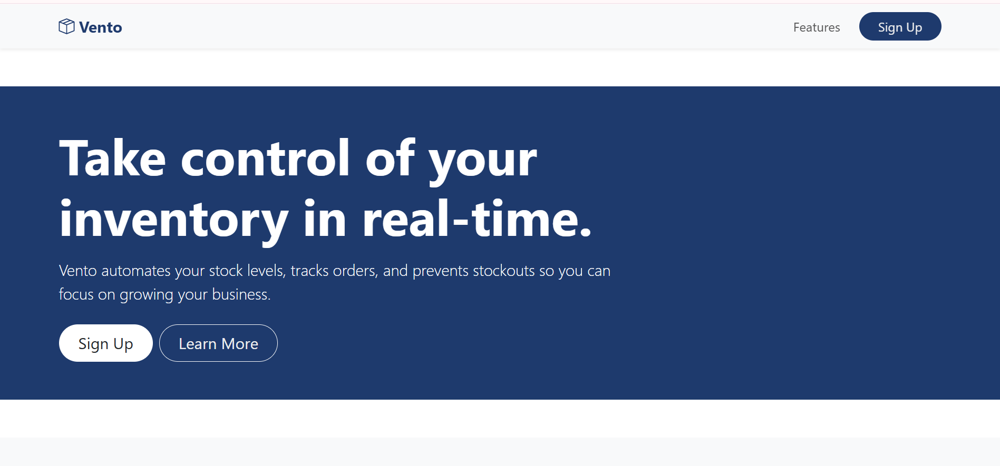
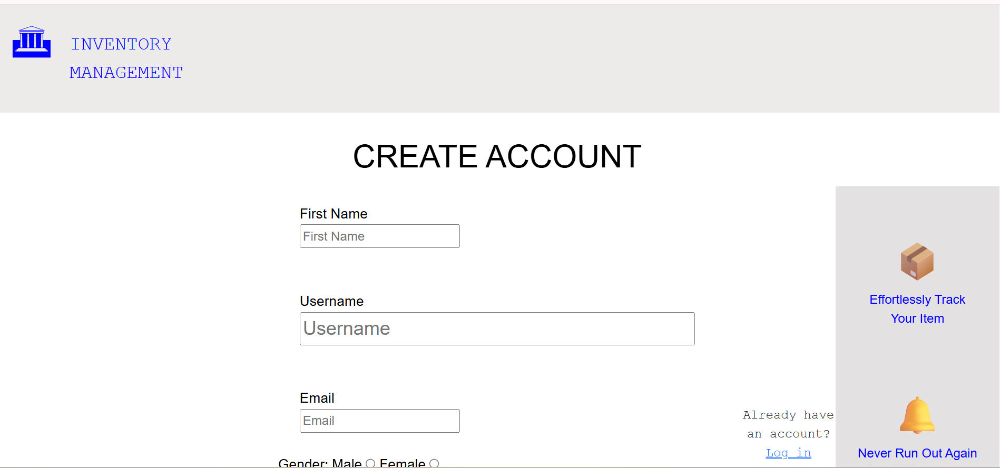

# SEN 311 Group H — Inventory Management System

## 🎥 Video Demonstration
[Watch Demo](https://www.loom.com/share/976bea21e9294dc88f6623f2b7cff660)

---

## 👥 Group Members

| Name | Matric Number |
|---|---|
| Emmanuel Birikuro | 2024/A/SENG/0037 |
| Odunuga Pelumi | 2024/C/SENG/0437 |
| Abdulkarim Abdulkarim | 2024/A/SENG/0139 |
| Ejekwuone Destiny | 2024/A/SENG/0056 |
| Paul Olutosoye | 2024/A/SENG/0150 |
| Marvellous Ibironke | 2024/A/SENG/0044 |
| Oluwaferanmi Ayegun | 2024/C/SENG/0744 |

---

## 🛠️ Tech Stack

- **Frontend:** HTML, CSS, Bootstrap 5
- **Backend:** Python, Flask
- **Database:** MySQL

---

## ✅ Features

- User Signup with form validation
- Password hashing with `werkzeug.security`
- User Login with session management
- Protected Dashboard (only accessible when logged in)
- Logout functionality

---

## 📁 Project Structure

GroupH_SEN311_Project/
├── app.py
├── setup_database.sql
├── README.md
├── templates/
│   ├── index.html
│   └── signup.html
└── assets/
    ├── homepage_screenshot.png
    └── signup_screenshot.png


---

## ⚙️ Prerequisites
```bash
pip install flask mysql-connector-python werkzeug python-dotenv
```

---

## 🗄️ Database Setup

Open MySQL Workbench or your terminal and run:
```bash
mysql -u root -p < setup_database.sql
```

Or paste the contents of `setup_database.sql` directly into phpMyAdmin or MySQL Workbench.

---

## 🚀 How to Run Locally

1. Clone the repository
```bash
git clone https://github.com/miva-mid-semester-group-H/Inventory-Management-Project.git
cd Inventory-Management-Project
```

2. Install dependencies
```bash
pip install flask mysql-connector-python werkzeug python-dotenv
```

3. Run the SQL script to set up the database

4. Start the Flask server
```bash
python app.py
```


## 🗄️ Database Setup

This project uses **Railway** as the hosted MySQL database.

### For the grader (local MySQL):

Run the SQL script in MySQL Workbench or your terminal:
```bash
mysql -u root -p < setup_database.sql
```

Or paste the contents of `setup_database.sql` directly into phpMyAdmin or MySQL Workbench.

### For Railway (live deployment):

1. Go to [railway.com](https://railway.com) → New Project → Add Service → MySQL
2. Copy the credentials from the **Variables** tab
3. Create a `.env` file in the project root:
```env
MYSQL_HOST=your_host.railway.com
MYSQL_PORT=your_port
MYSQL_USER=root
MYSQL_PASSWORD=your_password
MYSQL_DATABASE=railway
```

4. Paste and run `setup_database.sql` in Railway's Query tab

5. Visit in your browser


---

## 📸 Project Screenshots

**Homepage:**


**Signup Page:**


---

## 🏫 Institution

Miva Open University — Software Engineering, SEN 311 Mid-Semester Group Project